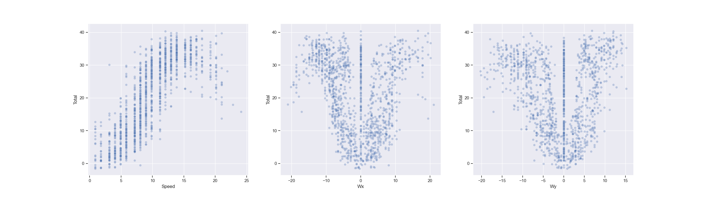
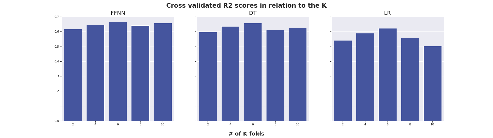

## Intro
This report summarizes my process of finding an optimal model for prediction of
power production based on given weather data. Further, I also elaborate on the
pros and cons of using `mlflow` as a tool to track and deploy machine learning
experiments. This will also be put in the context of other available options.

## Choice of models, evaluation metrics and results
### Problem description and strategy
I want to start by stating the overall goal of this project:

> To find an optimal model for prediction of power production based on the
  provided `static` dataset while using `mlflow` as a main tool to track the whole
  process. Last but not the least, to deploy the best model on Azure VM.

### EDA, preprocessing and choice of models
My first step was to examine the given dataset. From the available columns,
I decided to use the following as features:

- `Speed`
- `Direction`

I did not consider `Lead_hours` as a feature since for all the records, it was 1. Similarly, the remaining columns did not provide any useful information and therefore I also dropped them to free space in memory. In addition, the raw dataset included `254,967`, yet after removing rows with missing values, I ended up with a dataset which has only `1318` records. Finally, wind direction was encoded as a `string` which from a model perspective might not be telling the full information. Therefore, I decided to transform this wind direction into a wind vector. I already explained this step in detail [here](https://github.com/LudekCizinsky/time-series-prediction/blob/main/report.md#preprocessing). Thus, to summarize, I ended up after preprocessing with the following dataset:
- `1318` records
- `4 columns`: Speed, Wx, Wy, Total where Wx and Wy are components of the wind
  vector

More importantly, I wanted to further understand the features that are at my
disposal, therefore, I created a scatter plot which shows a relationship between the predicted value (`Total`) and predictors:



We can see that the relationship between power and speed seems quite `linear`.
However, this can not be said about the other two independent variables where
we rather see a non-linear relationship. In addition, we can see that the units
of the features are different. Therefore, there are following implications
for the modelling part:

- There is a need for feature `normalization` - for this I used `Standard
  scaler` from the `sklearn` library

- Given a very small number of data points relative to the number of features,
  the model might over-fit due to the `curse of dimensionality`. Therefore,
  I should start with a model which is less complex and use is as a valid
  baseline and then try to increase the complexity - for this reason I started with `Linear regression`, increase the complexity   by using `Decision tree` and finally, I also tried `Feed forward neural network`

- Choosing valid sets of features is a problem in itself, therefore, I used `sklearn`'s method `SelectKbest` 

### Methodology
The `mlflow` framework is designed around the concepts of `experiments` and `runs`. Following the documentation, experiment groups `runs` with a similar objective. Therefore, I decided to have a single experiment - `Orkney - power production prediction`. Further, I used `sklearn`'s grid search to find optimal hyper-parameters for the given model. Yet, grid search itself has an hyperparameter which is how many splits should be used during cross-validation. For this reason, each of my runs represents a run of grid search with given number of splits for cross validation.

### Metrics choice
I decided to track several metrics: `r-squared` (R2), `mean absolute error` (MAE), `mean squared error` (MSE), `maximum error` (ME). While MAE and MSE take into account residuals, R2 in addition puts this information in the context of variance of the target variable. Therefore, I decided to use R2 as the metric to use when deciding which model is the best one. In addition, it is easy to interpret. I will further discuss these in the following section.

### Results
#### Choice of best model and discussion
I would like to start with a figure which summarizes my results:



As can be seen from the figure, on average, the best performing model based on
the R2 score is `FFNN`. For all possible number of splits, the cross validated R2 score for `FFNN` has been always within `0.6` and `0.67`. This simply means that independently of the size of input training data, `FFNN` has been able to learn the patterns in the data well enough such that its performance was relatively stable and thus the generalization capability of the model is decent. This, however, can not be said about the linear regression model whose performance varied a lot in relation to the chosen number of splits. In addition, `LR` is clearly the worst performing model. Given these results, I decided to deploy `FFNN` as the final model.

Looking more closely on the chosen model, following hyper-parameters have been
chosen:

```
activation : relu
hidden_layer_sizes : [10, 15]
learning_rate_init : 0.01
max_iter : 1000
selectkbest__k : 1
```

Perhaps the most interesting to observe is that the model decided to use only
one feature. In the context of `FFNN` this might not be surprising since it can
easily overfit, therefore, it was more beneficial to use less features in order
to achieve better generalization. The same can be confirmed by the number of
neurons in each hidden layer which is in fact the least complex combination. One
further thing to consider is the number of epochs that it took to train this
model which is quite large. Here I assume I am not restricted by the
computational power, but if the model would have to be re-trained on for example
an edge device, then a model like `LR` regression might be more suitable.

Finally, examining the performance of this best model on other metrics:

```
Cross validated ME: 20.92249850330339
Cross validated MAE: 4.675845283832494
Cross validated MSE: 36.60973648174768
```

If it is critical for our use case not to make too big mistakes, then it might
be important to take into consideration `ME` instead of `R2`. In this particular
case, on average, the best model's worst prediction was off by `20.92`. To avoid
big mistakes, `MSE` might be also a good option since from its definition it
punishes the model more by making bigger mistakes compare to the `MAE`. Looking
at the actual values, I would say that these are solid results relative to the
task difficulty as well as complexity of the model.

#### Choosing number of splits for cross validation
In this section, I would like to briefly discuss the choice of cross validation
parameter. The core idea is to obtain an estimate of the target score which will
give me a good idea of how well the model will perform on unseen data. In
theory, the more splits we conduct, the more times we will have an opportunity
to see how the model performs. This is of course desirable, but in practice, it
is often infeasible to do many splits since computational time grows
non-linearly with respect to the increased number of splits. (especially when
using grid search to also find optimal hyper parameters) Loosely speaking,
looking at the figure above, I would conclude that it is reasonable to choose
a `K` which is between 5 to 10. This should be an optimal tradeoff between
finding a model which can generalize well and the overall training time.

## ML lifecycle and reproducibility

### Key features of reproducible ML systems
First, I would like to define my understanding of a reproducible ML system:

> A reproducible ML system is a system which I can run in any environment and
  I will be able to obtain the same results independently of the given
  environment.

The most important word in the context of reproducibility is an `environment`.
This is a broad term, therefore, here is non-exhaustive list of what can be
meant under this term:
- used packages and their corresponding versions
- used dataset
- used hyper-parameters of the model
- used preprocessing steps
- expected results
- ...

In addition, ML systems evolve and therefore, there might be some updates to it
and as such the environment requirements must also be updated. Therefore,
reproducible ML system should:
- include all the necessary meta information 
- enable the client to execute it with ease independently of the client's
  current environment
- tightly connected to the previous point, the model should be easily deployable
  to any platform

### Option 1: Bundle several things together
The most naive option is to simply meet the above requirements by integrating
several tools together. For example, for experiment tracking, one could use
python's built in logging library. To allow the user reproduce a result, one
could simply write a `bash` script which takes care of installing all the
necessary dependencies and then runs the code. The advantage of this approach
is that one does not have to rely on an external tool and does not need to learn
its way of doing things. This approach might work for small projects, but it is
rather suboptimal for large projects.

### Option 2: Use ML flow
The great thing about `MLflow` is that it provides its users with a simple to
use `SDK` (e.g. in Python) via which one can track the whole ml system. The
tracking API not only allows to save key, value pair info, but also more
advanced objects such as figures or even for example pandas data frame.
Therefore, in comparison to the previous option, `MLflow` offers an out of the
box solution which is relatively easy to learn and is usable within larger
projects or organizations.

Another important part of reproducible ML systems is having outside users being
able to use the created model. `MLflow` for this reasons offers its standardized
packaging format called `Projects`. Using this format, user can reproduce the
code on any platform. This is again a huge gain compare to the previous option
where we have to manually code things from scratch and are likely to make many
mistakes. 

Overall, using `MLflow` solves all the above mentioned requirements for
a reproducible ML system. Another great thing about this platform is that it is
open source and there is a great community of developers around it which means
that we can expect new features as well as fixes of the existing problems.

### Other options
In the recent years, there has been a boom in `MLops` tools. One of the most
established tools out there is for example `Apache airflow` which offers many
features, but it is more difficult to learn. Compare to `MLflow`, it might be
more suitable to be used in the context of large organizations and projects. 

